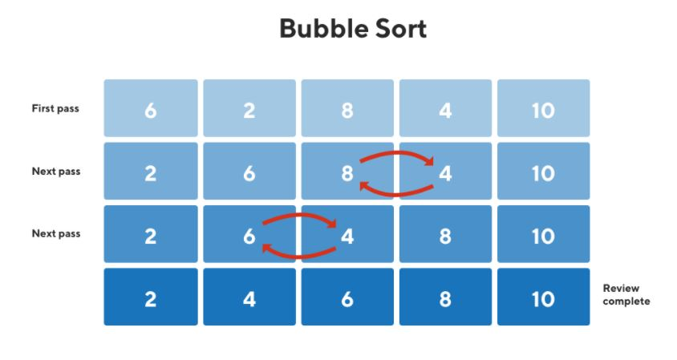

## [Bubble Sort](https://codestudio-infra.codingninjas.com/studio/problems/bubble-sort_980524?interviewProblemRedirection=true&search=Bubble%20sort)

### Easy

---

**Average time to solve:** 10m

---

### Problem statement

Bubble Sort is one of the sorting algorithms that works by repeatedly swapping the adjacent elements of the array if they are not in sorted order.

You are given an unsorted array consisting of N non-negative integers. Your task is to sort the array in non-decreasing order using the Bubble Sort algorithm.

For Example:  
Bubble Sort implementation for the given array: `{6,2,8,4,10}` is shown below.

---

### Detailed explanation


---
#### Constraints:

- `1 <= T <= 100`
- `1 <= N <= 100`
- `1 <= Arr[i] <= 1000`

Where **T** represents the number of test cases, **N** represents the size of the array, and **Arr[i]** represents the elements of the array.

**Time Limit:** 1 sec

---

### Sample Input 1:

```

1
5
6 2 8 4 10

```

### Sample Output 1:

```

2 4 6 8 10

```

---

### Sample Input 2:

```

2
2
1 2
4
4 3 2 1

```

### Sample Output 2:

```

1 2
1 2 3 4

```

---
