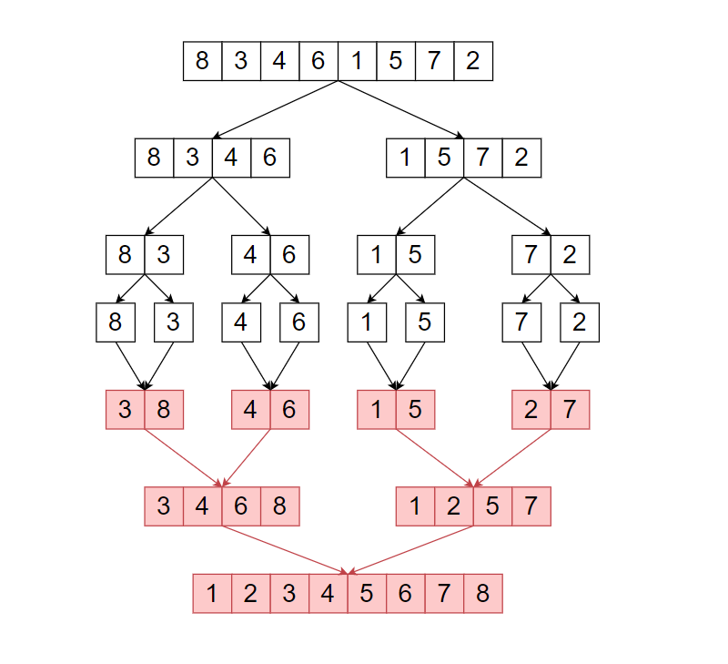

## [Merge Sort](https://codestudio-infra.codingninjas.com/studio/problems/merge-sort_920442?interviewProblemRedirection=true&search=Merge%20Sort)

### Easy

---

**Average time to solve:** 15m

---

### Problem statement

Given a sequence of numbers **‘ARR’**, your task is to return a sorted sequence of **‘ARR’** in non-descending order using the **merge sort** algorithm.

---

### Example

**Merge Sort Algorithm:**  
Merge sort is a Divide and Conquer based algorithm. It divides the input array into two parts until the size of each subarray is 1. Then it merges the two sorted arrays to return a completely merged and sorted array.

---

**Note:**  
It is compulsory to use the **‘Merge Sort’** algorithm.

---

### Detailed explanation


#### Constraints:

- `1 <= T <= 50`
- `1 <= N <= 10^4`
- `-10^9 <= arr[i] <= 10^9`

**Time Limit:** 1 sec

---

### Sample Input 1:

```

2
7
3 4 1 6 2 5 7
4
4 3 1 2

```

### Sample Output 1:

```

1 2 3 4 5 6 7
1 2 3 4

```

**Explanation For Sample Input 1:**

- **Test Case 1:**

  Given **‘ARR’** : `{ 3, 4, 1, 6, 2, 5, 7 }`  
  The sorted **'ARR'** in non-descending order will be : `{ 1, 2, 3, 4, 5, 6, 7 }`.  
  Non-descending order means every element must be greater than or equal to the previous element.

- **Test Case 2:**

  Given **‘ARR’** : `{ 4, 3, 1, 2 }`  
  The sorted **'ARR'** in non-descending order will be : `{ 1, 2, 3, 4 }`.

---

### Sample Input 2:

```

2
4
5 4 6 7
3
2 1 1

```

### Sample Output 2:

```

4 5 6 7
1 1 2

```

---
