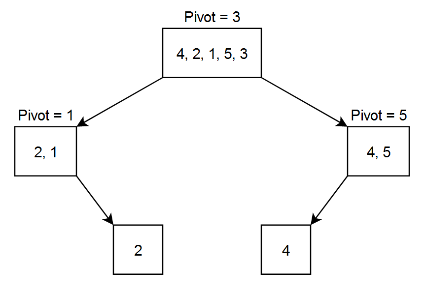

## [Quick Sort](https://codestudio-infra.codingninjas.com/studio/problems/quick-sort_983625?interviewProblemRedirection=true&search=Quick%20Sort)

### Moderate

---

**Average time to solve:** 10m

---

### Problem statement

You are given an array of integers. You need to sort the array in ascending order using **quick sort**.

Quick sort is a divide and conquer algorithm in which we choose a pivot point and partition the array into two parts: left and right. The left part contains the numbers smaller than the pivot element, and the right part contains the numbers larger than the pivot element. Then we recursively sort the left and right parts of the array.

---

### Example

Let the array = `[4, 2, 1, 5, 3]`  
Let pivot be the rightmost number.

- After the **1st level partitioning**, the array will be `{2, 1, 3, 4, 5}` as **3** was the pivot.  
- After the **2nd level partitioning**, the array will be `{1, 2, 3, 4, 5}` as **1** was the pivot for the left part and **5** was the pivot for the right part.  
Now the array is sorted and there is no need to divide it again.

---

### Detailed explanation


#### Constraints:

- `1 <= T <= 10`
- `1 <= N <= 10^3`
- `-10^9 <= ARR[i] <= 10^9`

Where **T** is the number of test cases, **N** is the length of the array **ARR**, and **ARR[i]** is the array element at index i.

**Time limit:** 1 sec

---

### Sample Input 1:

```

2
5
4 2 5 1 3
4
6 2 4 1

```

### Sample Output 1:

```

1 2 3 4 5
1 2 4 6

```

**Explanation of Input 1:**

- **Test case 1:**  
  Given array = `[4, 2, 5, 1, 3]`  
  Sorted array = `[1, 2, 3, 4, 5]`

- **Test case 2:**  
  Given array = `[6, 2, 4, 1]`  
  Sorted array = `[1, 2, 4, 6]`

---

### Sample Input 2:

```

2
5
5 3 2 6 4
4
1 2 3 4

```

### Sample Output 2:

```

2 3 4 5 6
1 2 3 4

```

---
